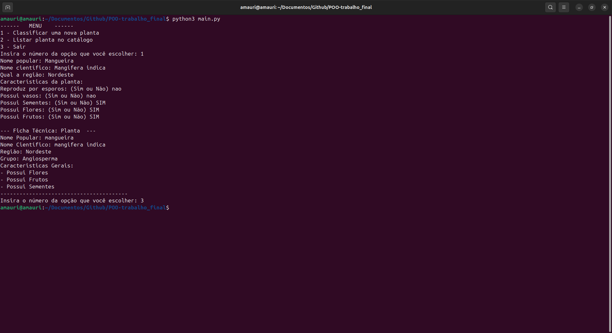
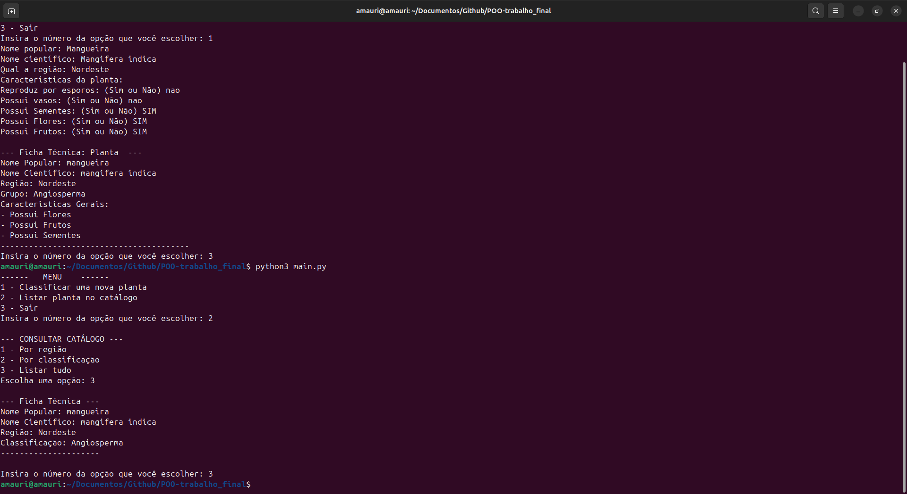
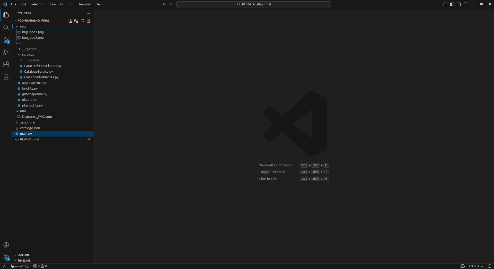

# Sistema de Classificação de Plantas (POO)

Este projeto implementa um sistema para classificação e catalogação de plantas, desenvolvido como Trabalho Final da disciplina de Programação Orientada a Objetos.

## 📋 Sobre o Projeto

O sistema simula uma ferramenta que precisa identificar a classificação de plantas (Briófitas, Pteridófitas, Gimnospermas, Angiospermas) com base em suas características evolutivas (vasos, esporos, sementes, flores, frutos).

### Funcionalidades
- **Classificação Automática**: Identifica o filo da planta com base em perguntas simples (Sim/Não).
- **Catalogação**: Salva as plantas classificadas para consulta posterior.
- **Persistência de Dados**: Os dados são salvos automaticamente em `catalogo.json`, permitindo que o catálogo seja recuperado ao reiniciar o programa.
- **Consulta**: Permite listar plantas por Região ou Classificação.

## 🚀 Como Executar

### Pré-requisitos
- Python 3.x instalado.

### Passo a Passo
1. Clone ou baixe este repositório.
2. Navegue até a pasta raiz do projeto.
3. Execute o arquivo `main.py`:

```bash
python3 main.py
```

## 🛠️ Estrutura do Projeto

O projeto segue uma arquitetura em camadas para respeitar boas práticas de POO:

- **`main.py`**: Ponto de entrada e interação com o usuário (Interface).
- **`src/services/`**:
    - `ClassificadorPlantas.py`: Lógica de negócio pura para determinar a classe da planta.
    - `CatalogoService.py`: Gerenciamento de persistência de dados (JSON).
- **`src/` (Domínio)**:
    - `planta.py`: Classe base (Conceito de Herança).
    - `briofita.py`, `pteridofita.py`, etc.: Subclasses especializadas (Polimorfismo).

## 🧠 Conceitos de POO Aplicados
- **Abstração**: Modelagem das características essenciais das plantas.
- **Encapsulamento**: Lógica de classificação isolada em serviço específico.
- **Herança**: Classes filhas herdando atributos base de `Planta`.
- **Polimorfismo**: Comportamentos espefícicos (como exibição de informações) sobrescritos nas subclasses.

## Evidências de Execução



Demonstração da classificação automática de uma Angiosperma.



persistência de dados: sistema carregando registros salvos via JSON.


Evidência da estrutura do projeto.


## 👤 Autor
Desenvolvido por José Amauri
Estudante de Análise e Desenvolvimento de Sistemas.
